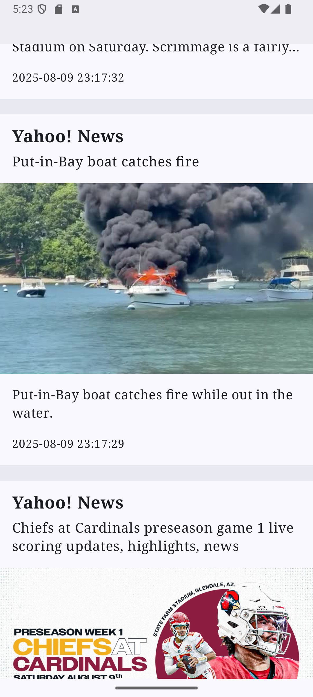

# Kotlin News App Demo

  
A simple Android news application built with Kotlin, demonstrating modern Android development practices. This app fetches news articles from an API and displays them to the user.

## ✨ Features

*   Browse the latest news headlines.
*   View detailed article content.
*   [Add more specific features, e.g., Search functionality, categorized news, bookmark articles, etc.]
*   Clean, Material Design interface.
*   Built entirely in Kotlin.
*   Utilizes modern Android Jetpack libraries.

## 🛠️ Built With

*   **Kotlin:** Primary programming language.
*   **Android Jetpack:**
    *   **View Binding / Data Binding:** (Specify which one you used) For easily accessing views.
    *   **ViewModel:** To store and manage UI-related data in a lifecycle-conscious way.
    *   **LiveData / Kotlin Flows:** (Specify which one) For observable data.
    *   **Room:** (If you use local persistence) For local database storage.
    *   **Navigation Component:** (If you use it) For handling in-app navigation.
    *   **Compose:** (If your UI is built with Jetpack Compose)
*   **Retrofit:** For type-safe HTTP calls to fetch news data.
*   **Gson / Moshi / Kotlinx.serialization:** (Specify which one) For parsing JSON data.
*   **Coroutines:** For asynchronous programming.
*   **Glide / Coil:** (Specify which one, if used) For image loading.
*   **[Add any other significant libraries or tools, e.g., Hilt/Koin for Dependency Injection, specific UI libraries]**

## 📰 News API

This app fetches news data from [Name of the News API, e.g., NewsAPI.org, The Guardian API, etc.].
*   [Optional: Add a link to the API documentation if it's public]
*   [Optional: Mention if an API key is required and how to obtain it if someone wants to build the project.]

## 🚀 Getting Started

### Prerequisites

*   Android Studio (latest stable version recommended)
*   Kotlin installed with Android Studio
*   [Any other specific requirements, e.g., specific Android SDK version]

### Installation & Setup

1.  **Clone the repository:**
